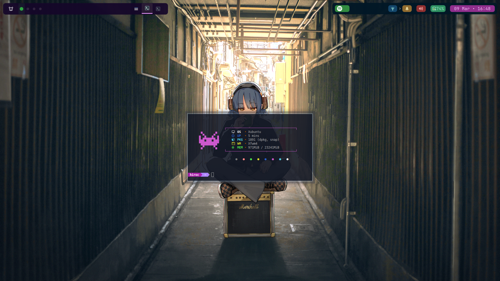
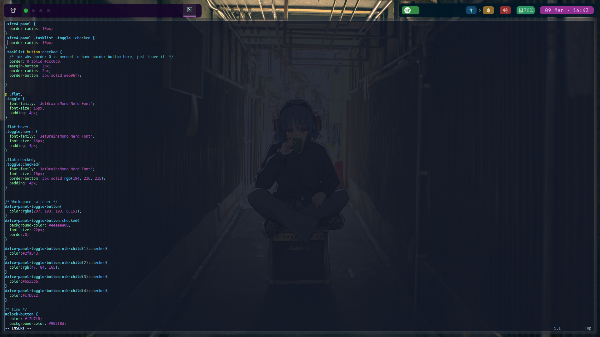
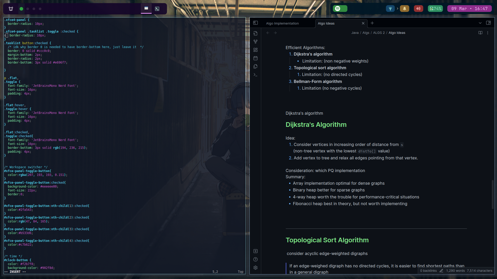

Previews, some notes of the cofig files, and lastly settings changes using GUI

# Previews 

# .config
## System Information
OS: Xubuntu 
DE: xfce 4.16 
WM: xfwm 4 
WM theme: [2bxfwm lucy](https://github.com/addy-dclxvi/xfwm4-theme-collections) 
Style: [Gruxbox-Dark-B-LB](https://www.gnome-look.org/p/1681313/) 
Spotify player: [genmon plugin](https://github.com/xtonousou/xfce4-genmon-scripts) 
Fancy bash prompt: [synth-shell](https://github.com/andresgongora/synth-shell)

---

## Take note
- my genmon id in `gtk.css` will be different from yours. To check its id, open `panel preferences > items` and hover over the spotify genmon
- the `ascii.txt` inside `.config/neofetch` uses terminal color 6 which is purple for me. Change it as you like 
- My wallpapers are 1920 x1080 and mostly fromm [wallhaven](https://wallhaven.cc)

# XFCE Settings (GUI)

## Panels 
Set your own panel bg colors (dont set panel bacnground color in  `gtk.css` unless you want all panels to have the same bg color)

my colors are  
#150729 ,opacity: 93 
#021826, opacity: 93

length and sizes of panel

panel 1 items

panel 2 items

---
## Terminal apperance preferences 

--- 
## Workspaces
Unicode character: ●

Workspace Margins to not overlap panel because my panel is not touching the top

- Top margin: 58
- Other sides: 5

---

## Other settings changes

**1. Reduced window decoration opacity  **
- Window Managaer Tweaks > Composition > Opacity of window decoration
- Lower it to your liking. Mine is at ~50%.

  
**2. Clock Format **
- Right click on the clock > properties. Format: Custom Format  

  
**3. Format including the spaces at the ends: (copy the whole line below)  **
- &nbsp; %d %b • %H:%M &nbsp;

  
**4. Different wallpaper for each workspace**
- right click on the desktop > Desktop settings. Uncheck  'apply to all workspaces'.
- Go to each workspace and set desired wallpaper for each.
